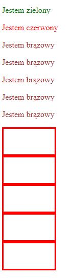

## Dodawanie styli do HTML-a

  Wykonaj poniższe polecenia. Po każdym z nich zrób następujące czynności:
  * zapisuj zmiany i odświeżaj przeglądarkę,
  * umieść komentarze z opisem co się zmieniło i dlaczego. Czy zaobserwowałeś jakąś zasadę CSS.

1. ZEWNĘTRZNY ARKUSZ STYLI, niebieskie tło 
  W katalogu **css** stwórz plik **style.css** i ustaw w nim niebieski kolor tła elementowi **body**.

1. WEWNĘTRZNY ARKUSZ STYLI, różowe tło
  Dodaj wewnętrzne style do sekcji **head** pliku **html**. Ustaw w nich różowy kolor tła elementowi **body**. 

1. STYLE INLINE, zielone tło
  W pliku **html** do tagu **body** dodaj artybut **style**. Ustaw zielony kolor tła.

## class i id

Celem poniższych zadań jest odpowiednie korzystanie z selektorów elementu, klasy oraz identyfikatora (id). Wykonaj poniższe polecenia z zastosowaniem najwłaściwszych z nich.

1. Stwórz dwa paragrafy: 
  * pierwszy o zielonym kolorze czcionki,
  * drugi o fioletowym kolorze czcionki.

2. Stwórz kolejne pięć paragrafów. Ustaw wszystkim kolor czcionki na brązowy.

3. Stwórz pięć elementów **div** o klasie **block**, mają one mieć następujące własności:
  * szerokość 100px,
  * wysokość   50px,
  * grubość obramowania 3px.

  

## Potrzebujesz pomocy lub inspiracji?
* HTML i CSS &ndash; pre-work
